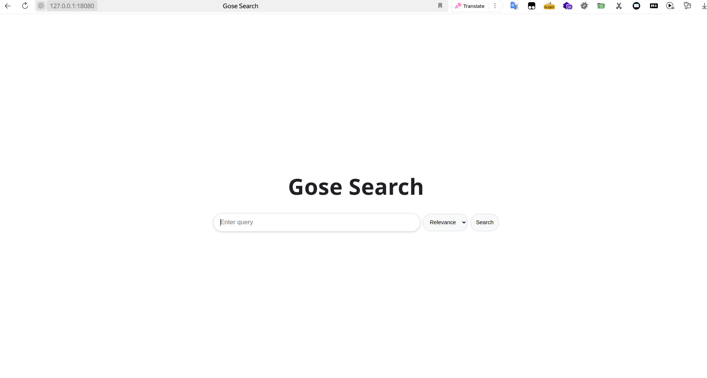
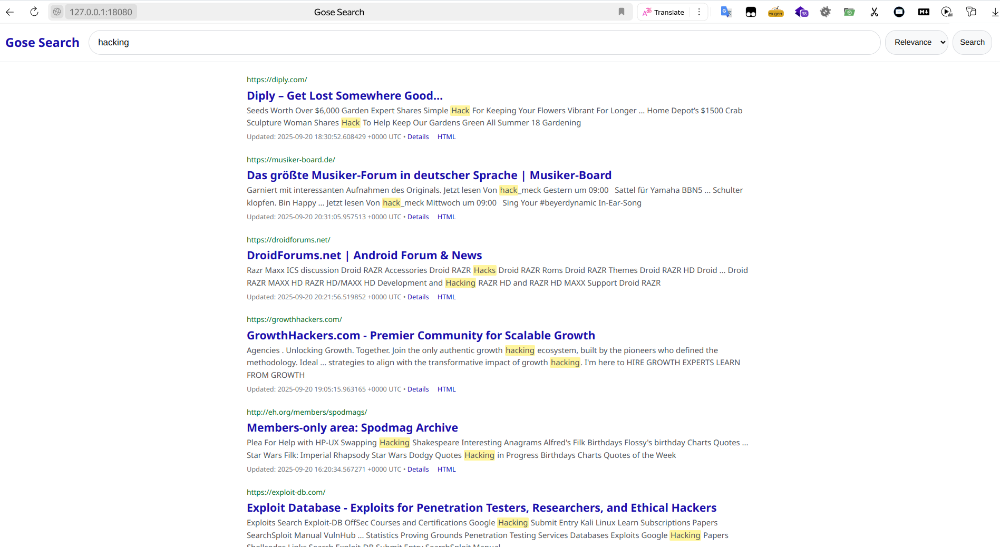
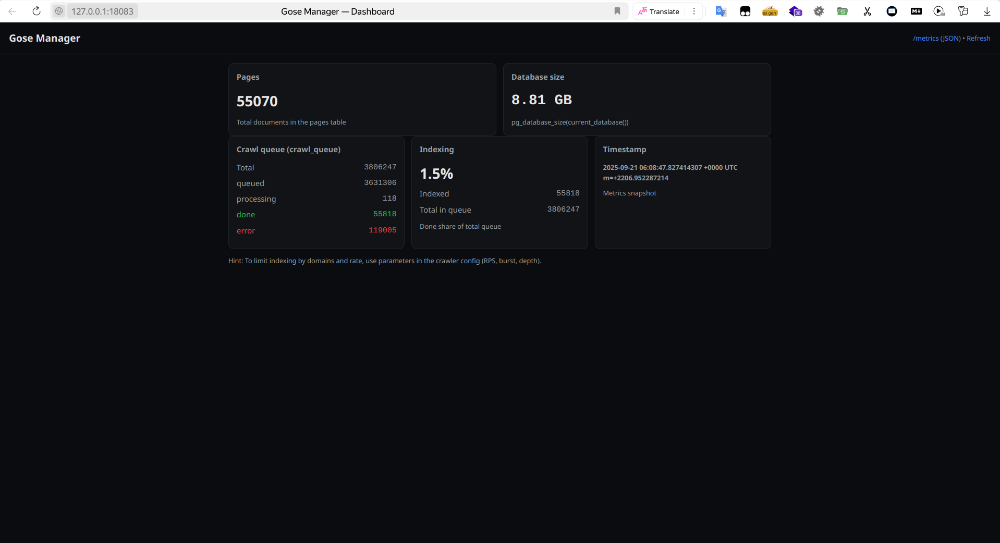
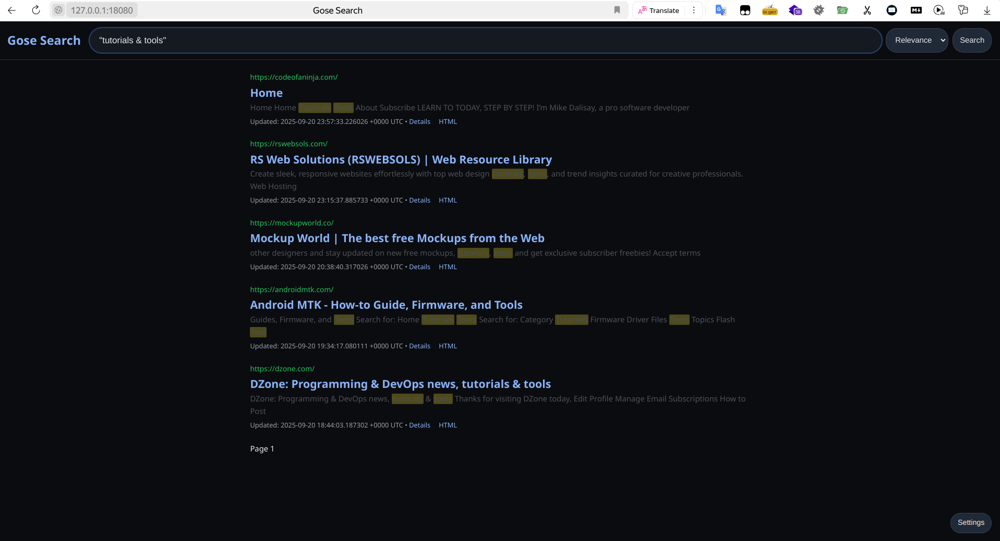

# Gose

Gose(Go search engine(MVP)) is a microservice-based web search system: a crawler collects websites and stores original HTML and extracted text in PostgreSQL, while the Search UI provides Russian/English full‑text search with snippet highlighting. It also includes a domain generator and a simple site manager, and ships with docker‑compose for local deployment.

### Screenshots

